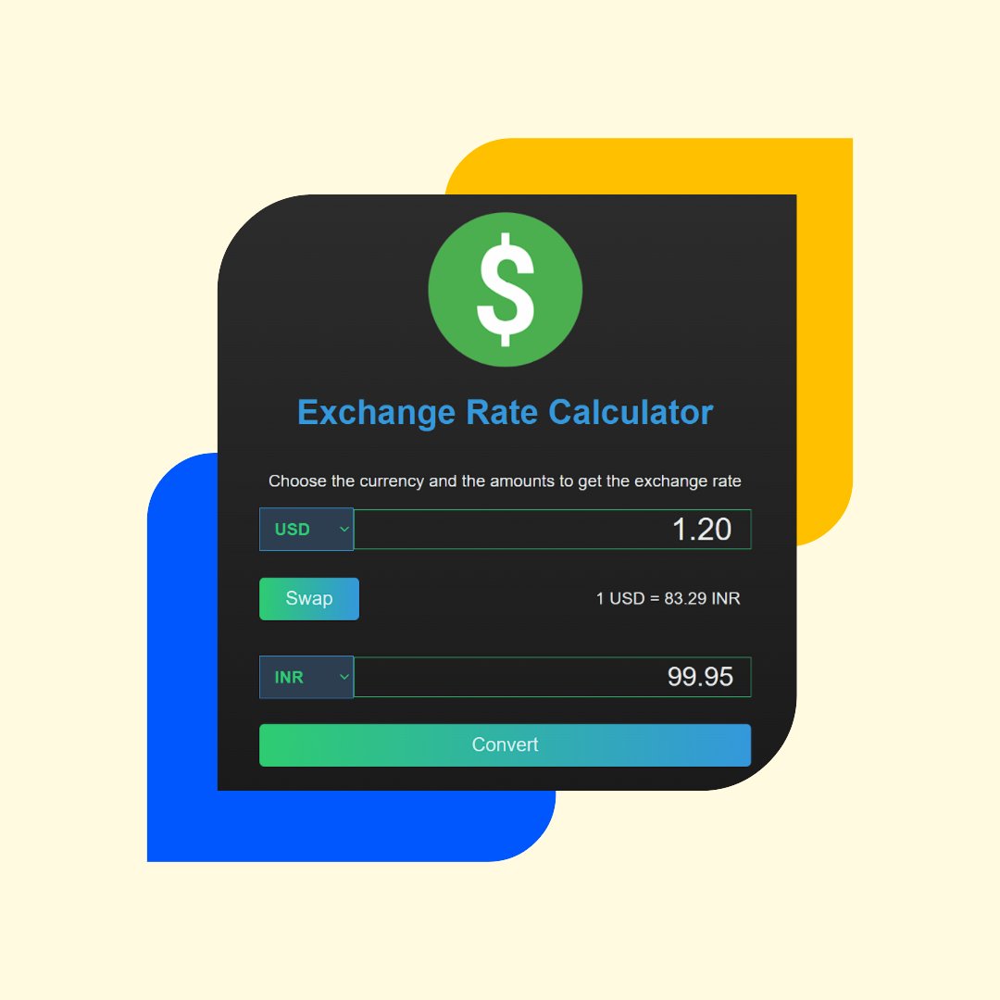

# RateSwap-Calculator 
RateSwap Calculator: Effortlessly convert and compare exchange rates with precision. Seamlessly swap between currencies, ensuring you get the best value for your transactions. Your go-to tool for quick and accurate currency exchange calculations.

- A currency converting app that can run `online` or `offline`
---
## Used Languages
- HTML5 ⚡
- CSS3 🌠
- Javascript 🌟
---
### 🔗🔗Link: https://iatharva26.github.io/RateSwap-Calculator/
---
### Landing page

---
## Running Currency Converter
### To run `Online`
- go to https://iatharva26.github.io/RateSwap-Calculator/

### To run `offline`
- Download the `RateSwap-Calculator.zip` folder from [here](https://github.com/iAtharva26/RateSwap-Calculator)
- Extract the folder
- Run the `index.html` file in your web browser
---
### To Do list
- [ ] Add more currencies
- [x] Make more Beautiful and responsive

#### 📫 Suggest your own features [here](https://github.com/iAtharva26/RateSwap-Calculator/issues/new)

---
## Can I Contribute?
- Sure, open an issue, point out errors, and what not. Wanna fix something yourselves, you're welcome to open a PR and I appreciate it.
